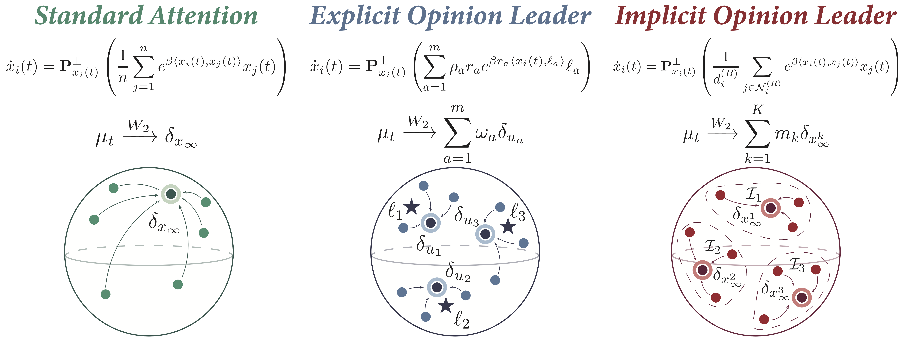
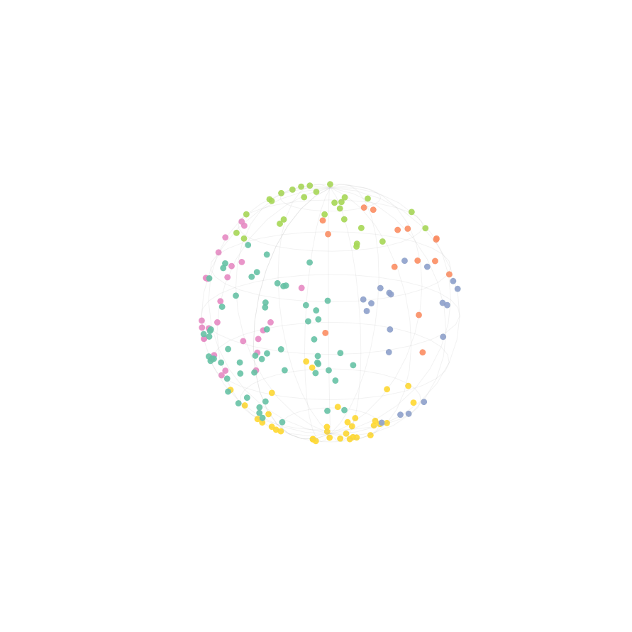
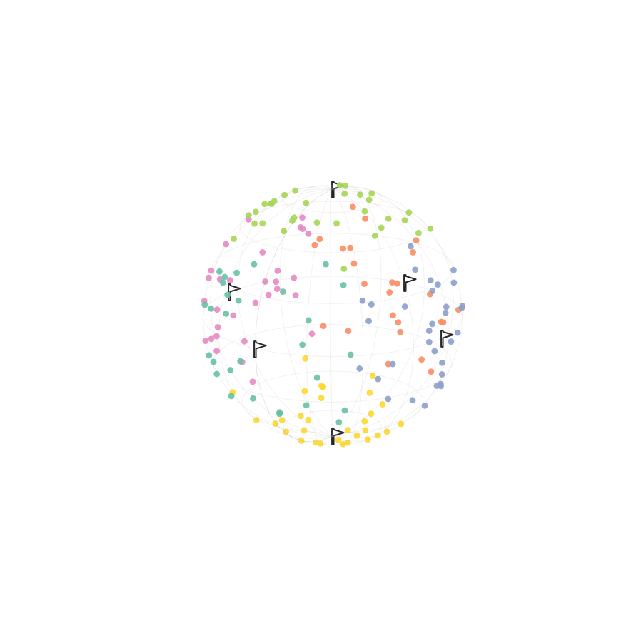
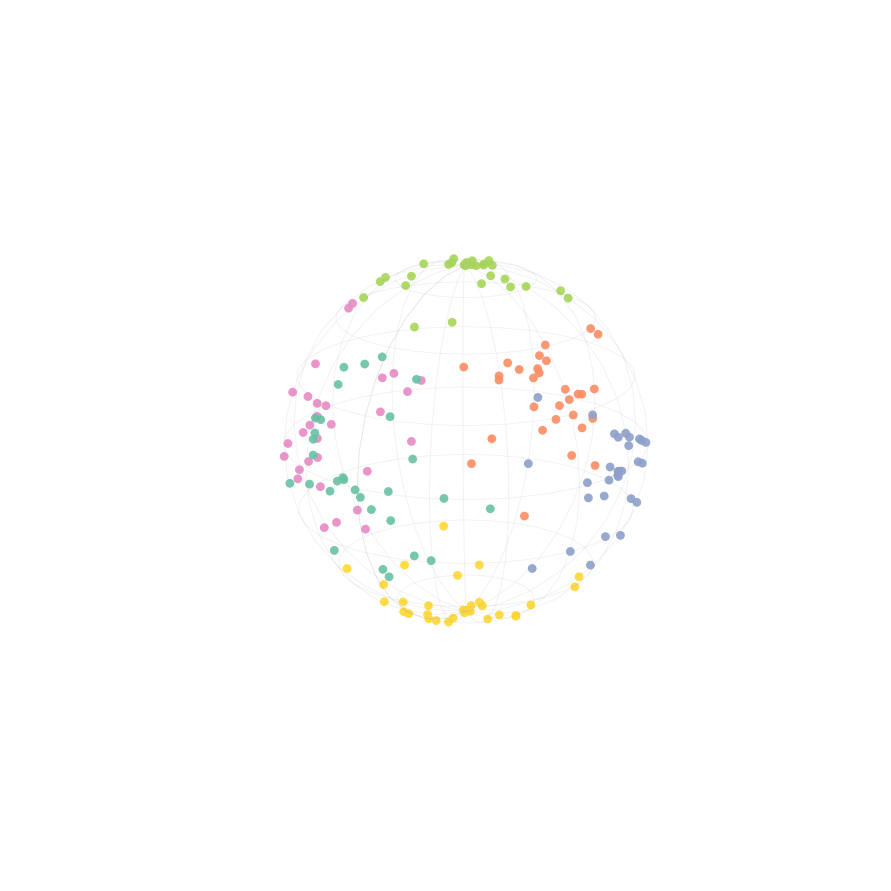

# Opinion Leader Dynamics: How Sparse Attention Shapes Token Clustering

This repository contains implementation for the paper "Opinion Leader Dynamics: How Sparse Attention Shapes Token Clustering". Sparse attention reduces the quadratic cost of global self-attention while retaining strong empirical performance, but how its restricted interactions shape the evolution of token representations remains theoretically underexplored. Modeling tokens as particles on the unit sphere, we introduce **opinion leader dynamics**, a framework that identifies two mechanisms through which token groups converge internally while maintaining distinct limiting directions. In the explicit model, fixed representatives induce a potential that attracts tokens toward distinct local maxima. In the implicit model, disconnected interaction groups evolve toward separate consensus directions. We formulate both models as \emph{reverse Wasserstein gradient flows} and establish exponential convergence under suitable conditions. We further connect these theoretical predictions to token evolution in frontier sparse-attention LLMs that motivate our framework. Across four benchmarks, $\\textcolor{#5178a1}{\\textbf{Kimi-K3}}$, $\\textcolor{#b11f23}{\\textbf{MiniMax-M3}}$,  and $\\textcolor{#5178a1}{\\textbf{DeepSeek-}}\\textcolor{#b11f23}{\\textbf{V4-Flash}}$ consistently exhibit clearer cluster separation and higher clustering scores than the dense-attention model  $\\textcolor{#148e6f}{\\textbf{GLM-4.7-Flash}}$ in projected token representations. These observations support the relevance of the predicted multiple-group structure to trained frontier LLMs, while finite-particle simulations illustrate the theoretical convergence behavior. Together, our results connect restricted token interactions to distinct group-level attractors, providing a dynamical account of how sparse attention can support alignment within groups while preserving separation between them.

## Opinion Leader Dynamics
<section class="hero teaser">
  <div class="container is-max-desktop">
    <div class="hero-body">
      <div class="has-text-centered">
         
             </div>
    </div>
  </div>
</section>
Comparison of three attention dynamics under the respective assumptions of our analysis.

## Attention Dynamics Simulation Results
<table align="center">
  <tr>
    <td align="center" width="33%">
      
      <br>
      Evolution of tokens under <b>Standard Attention</b> dynamics on the unit sphere.
    </td>
    <td align="center" width="33%">
      
      <br>
      Evolution of tokens under <b>Explicit Opinion Leader</b> dynamics on the unit sphere.
    </td>
    <td align="center" width="33%">
      
      <br>
      Evolution of tokens under <b>Implicit Opinion Leader</b> dynamics on the unit sphere.
    </td>
  </tr>
</table>

## Frontier LLM Analysis Visualization
<section class="hero teaser">
  <div class="container is-max-desktop">
    <div class="hero-body">
      <div class="has-text-centered">
         
             </div>
    </div>
  </div>
</section>

Layerwise evolution of token hidden states for **ARC-Easy** samples in $\\textcolor{#5178a1}{\\textbf{Kimi-K3}}$, $\\textcolor{#b11f23}{\\textbf{MiniMax-M3}}$,  and $\\textcolor{#5178a1}{\\textbf{DeepSeek-}}\\textcolor{#b11f23}{\\textbf{V4-Flash}}$, and $\\textcolor{#148e6f}{\\textbf{GLM-4.7-Flash}}$, visualized on unit sphere using **spherical UMAP**.

## Installation

### 1. Clone the Repository
```bash
git clone [https://github.com/Jingkun-Liu/Opinion-Leader-Dynamics.git](https://github.com/Jingkun-Liu/Opinion-Leader-Dynamics.git)
cd Opinion-Leader-Dynamics
```

### 2. Install Required Packages
```bash
pip install -r requirements.txt
```

## Project Structure

```text
Opinion-Leader-Dynamics/
├── images
├── README.md
├── requirements.txt           
├── simulation/
│   ├── main.py                 
│   ├── geometry.py             
│   ├── simulation_core.py      
│   ├── visualization.py        
│   ├── run_simulation.sh      
│   └── explicit_conditional/
│       ├── main.py             
│       ├── geometry.py         
│       ├── simulation_core.py  
│       ├── visualization.py    
│       └── run_simulation.sh   
└── observation/
    ├── main.py                 
    ├── runner.py               
    ├── model_loading.py        
    ├── prompts.py              
    ├── clustering.py           
    ├── baselines.py            
    ├── plotting.py             
    └── run_hellaswag.sh        
```

## Datasets

* **Frontier LLM Analysis**: The samples we used in our analysis are from [HellaSwag](https://huggingface.co/datasets/allenai/hellaswag), [HumanEval](https://huggingface.co/datasets/openai/openai_humaneval), [ARC-Easy](https://huggingface.co/datasets/allenai/ai2_arc), and [MATH](https://huggingface.co/datasets/EleutherAI/hendrycks_math).
* **Long-Context LLM Experiment**: The Variable Tracking (VT) data can be generated at the desired context length using the official [`variable_tracking.py`](https://github.com/NVIDIA/RULER/blob/main/scripts/data/synthetic/variable_tracking.py) script from [RULER](https://github.com/NVIDIA/RULER).
* **LLMs**: Frontier sparse-attention LLMs used in our paper are: [DeepSeek-V4-Flash](https://huggingface.co/deepseek-ai/DeepSeek-V4-Flash), [KiMi-K3](https://huggingface.co/moonshotai/Kimi-K3), [MiniMax-M3](https://huggingface.co/MiniMaxAI/MiniMax-M3), and [GLM-4.7-Flash](https://huggingface.co/zai-org/GLM-4.7-Flash).

## Dynamics Simulation

Run three attention dynamics simulations:

```bash
cd simulation
bash run_simulation.sh standard
bash run_simulation.sh explicit
bash run_simulation.sh implicit
```

`simulation/explicit_conditional/` provides a implementation for Explicit Opinion Leader experiments under Assumption 3.1 (geometric separation and dominance conditions).

```bash
cd ./simulation/explicit_conditional
bash run_simulation.sh
```

Results are written to `explicit_conditional/results/`.

## LLM Analysis

For example, to analyze the layerwise token evolution of DeepSeek-V4-Flash on HellaSwag, run the following command:

```bash
cd observation
bash run_hellaswag.sh
```

## Citation
If you find this research useful, please consider citing our work!
```bash
@article{liuopinion2026,
  title={Opinion Leader Dynamics: How Sparse Attention Shapes Token Clustering},
  author={Jingkun Liu and Yue Song},
  journal={ArXiv},
  year={2026}
}
```

## Issues
If you have any question, feel free to contact me at sjtu_ljk@sjtu.edu.cn
